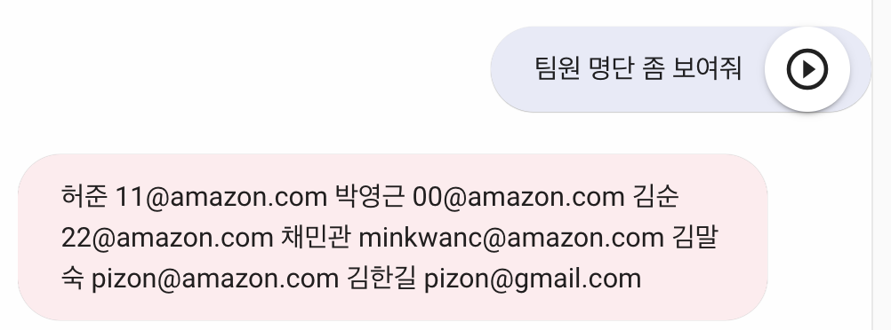

# SGHelper

## 소개
SGHelper는 AWS의 AI 음성 채팅앱 빌더인 Lex를 활용하여 만든 인프라 및 조직 관리 앱 샘플입니다. 
이 아키텍처와 샘플 소스를 응용하여, 조직 내에서 다양한 용도로 활용한 앱 개발이 가능합니다.

이 샘플 앱에서 현재 지원하는 기능은 다음과 같습니다.
- 인스턴스 관리 : 특정 리전의 인스턴스 목록을 가져오고, 지정한 인스턴스를 시작/중단 할 수 있습니다.
- 인스턴스 점검 : 최근 5분간의 CPU사용량이 일정량 이상인 인스턴스들을 검색합니다. (샘플에서는 0.5%로 설정)
- 팀원 관리 : 등록된 팀원 명단을 가져오고, 새로운 팀원을 등록할 수 있습니다.

이 샘플 앱은 [aws-lex-web-ui](https://github.com/aws-samples/aws-lex-web-ui) 에서 제공하는 WEB-UI 를 활용했습니다.
다음 워크샵에서 이 WEB-UI의 활용법과 [Amazon Lex](https://aws.amazon.com/ko/lex/)의 사용법을 익힐 수 있습니다.

Lex 워크샵 : https://catalog.us-east-1.prod.workshops.aws/workshops/94f60d43-15b7-45f4-bbbc-17889ae64ea0

## 아키텍처

- 이 샘플앱의 WEB-UI는 S3에서 웹호스팅하고 있으며, CloudFront를 통해 접속합니다.
- Lex는 사용자의 입력을 받아 Lambda의 API를 호출합니다.
- python으로 구현된 Lambda API는 EC2 API를 통해 EC2 인스턴스의 정보를 가져오거나 컨트롤합니다.
- 필요한 경우(이 샘플앱에서는 팀원 관리), DynamoDB에 데이터를 저장하거나 읽어옵니다.
  
## 사용법

샘플 앱 URL : https://bit.ly/sghelper

마이크 버튼을 누르고 말을 하거나, 텍스트를 입력하여 시작할 수 있습니다.
"인스턴스 목록"이라고 말하면 인스턴스의 목록 정보를 가져옵니다.
  

"x번 인스턴스 시작 혹은 중단"이라고 말하면 해당 인스턴스를 시작하거나, 중단할 수 있습니다.
(샘플앱에서는 테스트 계정에 인스턴스들을 가동 시켜 두었으니, 자유롭게 테스트가 가능합니다. 단, 다른 사용자와 명령이 겹쳐서 오작동으로 보일 수 있습니다.)

"인스턴스 점검"이라고 말하면 최근 5분간의 CPU사용량이 일정량 이상인 인스턴스들만 검색합니다. (샘플앱에서는 검색조건을 0.5%로 조정해두었습니다.) 

"팀원 목록"이라고 말하면 등록된 팀원의 목록을 볼 수 있습니다. 팀원 정보는 DynamoDB에 저장됩니다.

"팀원 추가"라고 말한 뒤, 이름과 이메일을 말하면 새로운 팀원을 등록할 수 있습니다. 샘플앱의 기본 언어 설정이 한국어로 되있기 때문에, 영어로 이메일을 말하면 잘 인식하지 못하는 경우가 있습니다. 이메일 입력 테스트는 텍스트로 진행합니다.

## 설치 방법

다음의 순서대로 SGHelper를 AWS 계정에 설치 할 수 있습니다.

### 봇 설치

[SGHelperLexBot.zip](https://github.com/iampizon/sghelper/blob/main/SGHelperLexBot.zip) 파일을 다운로드하고, Lex의 Bots 메뉴의 Import bot 기능으로 Bot을 설치합니다.

### WEB-UI 설치

[aws-lex-web-ui](https://github.com/aws-samples/aws-lex-web-ui) 를 설치합니다. Cloudformation 으로 설치할 수 있으니, 원하는 리전을 선택한 후 Launch 하면 됩니다.

Stack 설정 시에 위에 생성한 Lex 봇의 정보를 입력해야합니다. LexV2BotLocaleId 는 ko_KR을 입력합니다.

LexV2BotId 는 Bot details에서, 

LexV2BotAliasId 는 Alias 에서 각각 확인합니다. 

### Lambda 생성

[SGHelperLexLambdaFunc.py](https://github.com/iampizon/sghelper/blob/main/SGHelperLexLambdaFunc.py) 파일로 Lambda 함수를 생성합니다.
Timeout 1분으로 설정하고, EC2와 DynamoDB에 접근 권한 설정(FullAccess)을 해줍니다.

### 봇에 Lambda 설정

Lex Alias 에서 현재 사용중인 봇의 Alias 에서 Languages에서 "Korean(South Korea)" 링크를 클릭합니다.

위에 생성한 Lambda 함수를 설정해줍니다.

### 봇 빌드

Lex bot -> Bot versions -> Korean -> Intents 화면에서 Lex bot를 빌드합니다. 몇 분 정도 소요됩니다.

### Dynamodb 설정 

DynamoDB에 SGHelperMembers 테이블을 생성해줍니다.

### 테스트

Lex Intents 설정 화면에서 Test를 할 수 있습니다.
